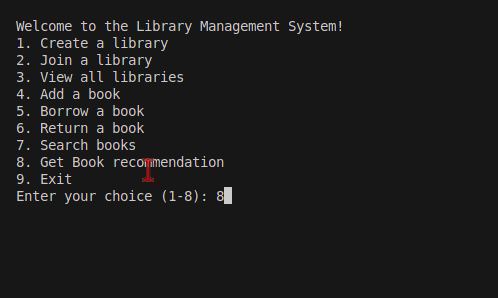

# Library Management System (CLI)



## Description
This is a **Command-Line Interface (CLI) Library Management System** built with Python and SQLAlchemy. It allows library owners to manage books, track borrowed books, and let members join a library.

## Features
- Library owners can create and manage libraries.
- Members can join a library and borrow/return books.
- Uses a **SQLite database** for storage.
- Database migrations handled by **Alembic**.
- Configuration managed with `.env` files.

## Installation

### Prerequisites
- Python 3.8+
- pipenv for virtual environment management

### Setup
1. **Clone the repository**
   ```bash
   git clone https://github.com/elishakaranja/Libro-LMS
   cd into the file

   pipenv install 
   pipenv shell 
   pipenv run alembic upgrade head
   pipenv run python cli/cli.py

### Usage
Once the script is running, follow the on-screen prompts to:

Create a library
Add books to a library
Allow members to borrow and return books
Track borrowed books

/LIBRO
|---modules.py
│── main.py            # Main entry point
│── library.db         # SQLite database file
│── migrations/        # Alembic migration scripts
│── .env               # Environment variables
│── Pipfile            # Dependency management
│── alembic.ini        # Alembic configuration
│── plan.txt           # Project notes
└── README.md          # Project documentation
   **enjooy**

   
License
This project is licensed under the MIT License.
